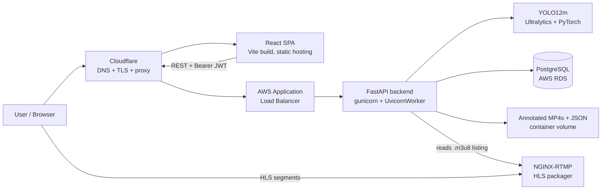
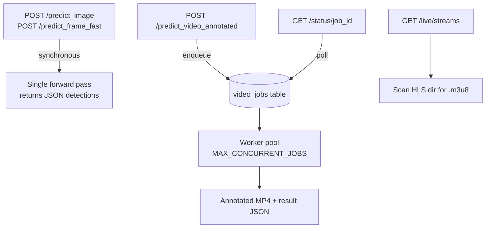
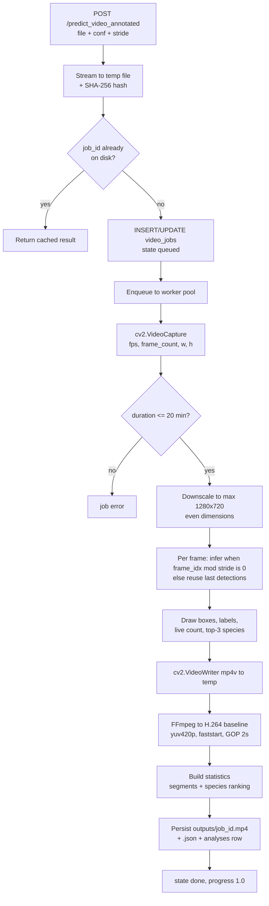
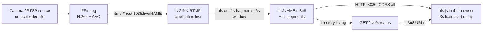
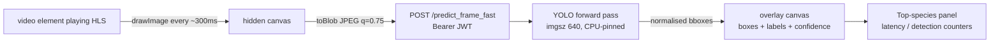
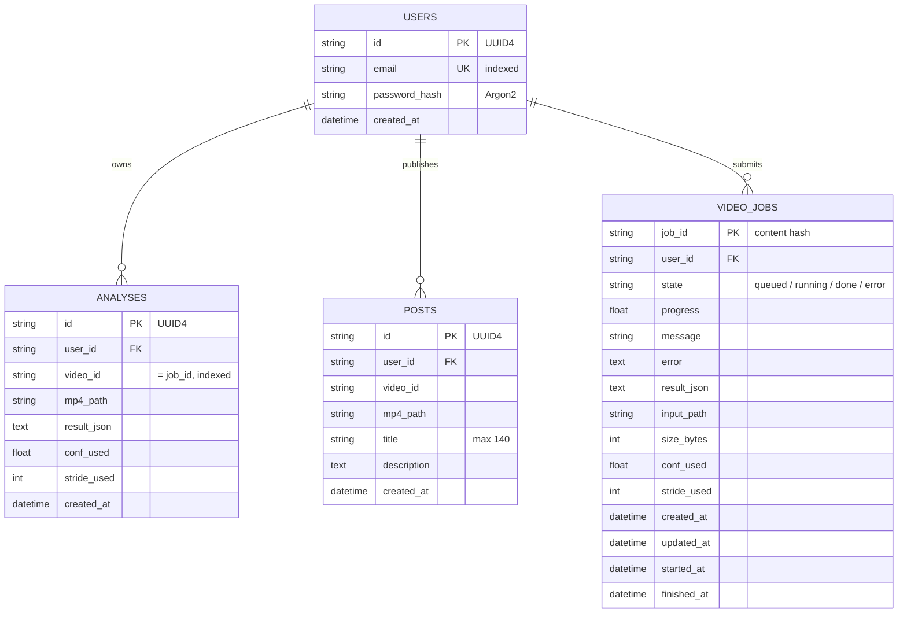
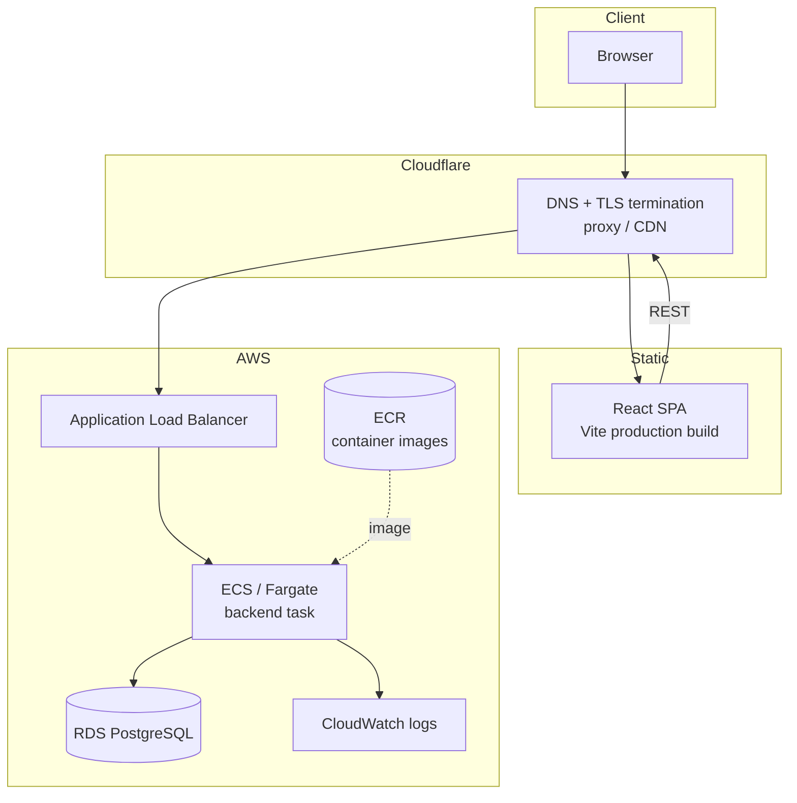

# BirdVision — Automatic Bird Detection & Identification

**An end-to-end computer vision platform for automatic bird species detection — not just a YOLO model.**
Dataset preparation, two-stage training, a GPU-aware FastAPI inference service, asynchronous video processing, an RTMP→HLS live-camera pipeline with real-time overlays, and a React SPA — all containerised and deployed on AWS.

Final Degree Project (TFG) — Computer Engineering, **EPSEVG · Universitat Politècnica de Catalunya (UPC)**
Developed in collaboration with the environmental association **Alytes (Canyelles)** for educational and outreach purposes.

[](https://github.com/Mampiz/birdvision/actions/workflows/backend.yml)
[](https://github.com/Mampiz/birdvision/actions/workflows/frontend.yml)
[](LICENSE)


<p align="center"><em>Annotated video output: three species tracked simultaneously with per-species colours, confidence scores and a running top-species HUD.</em></p>

---

## Demo

A **2 min 46 s screen recording** walks the whole system end to end — registration, image detection, video upload and annotation, publishing to the feed, browser-camera live mode, and the LiveCams HLS pipeline with real-time overlays:

▶️ **[docs/demo/birdvision-demo.mp4](docs/demo/birdvision-demo.mp4)** *(720p, 12 MB — GitHub shows a download link; click through to play it)*

<!--
  To get an INLINE player instead of a download link: open a new GitHub issue (do not
  submit it), drag docs/demo/birdvision-demo.mp4 into the comment box, wait for the
  upload, and copy the generated https://github.com/user-attachments/assets/... URL.
  Paste that bare URL on its own line in place of the link above — GitHub renders
  attachment-CDN video URLs as a player. Relative repository paths are never
  rendered as players, and <video> tags are stripped from README markdown.
-->


<p align="center">
  
  <br><em>LiveCams in motion — YOLO detections drawn over a live HLS stream, ~300 ms per inference round-trip.</em>
</p>

---

## Table of Contents

- [Demo](#demo)
- [Overview](#overview)
- [Key Features](#key-features)
- [System Architecture](#system-architecture)
- [Machine Learning](#machine-learning)
- [Results](#results)
- [Backend](#backend)
- [Video Processing](#video-processing)
- [LiveCams & Real-Time Streaming](#livecams--real-time-streaming)
- [Frontend](#frontend)
- [Database](#database)
- [API Reference](#api-reference)
- [Deployment](#deployment)
- [Security](#security)
- [Repository Structure](#repository-structure)
- [Installation](#installation)
- [Configuration](#configuration)
- [Local Development](#local-development)
- [Testing](#testing)
- [Engineering Decisions](#engineering-decisions)
- [Limitations](#limitations)
- [Future Work](#future-work)
- [Technologies](#technologies)
- [Screenshots](#screenshots)
- [Author & License](#author--license)

---

## Overview

The system lets a non-technical user point a camera — or upload a file — and get back **which bird species were seen, where, and when**.

Four operating modes are implemented:

| Mode | Input | Pipeline | Output |
|------|-------|----------|--------|
| **Image detection** | JPG/PNG/WEBP upload | Synchronous YOLO inference | Species, confidence, pixel + normalised bounding boxes, overlay in the browser, downloadable annotated JPG |
| **Video analysis** | MP4/MOV/WEBM upload (≤ 400 MB, ≤ 20 min) | Async job queue → OpenCV decode → strided inference → OpenCV render → FFmpeg H.264 transcode | Annotated MP4, species ranking, per-species time segments, progress polling by `job_id` |
| **Live (device camera)** | `getUserMedia` webcam | Browser captures JPEG frames on a timer → `POST /predict_frame_fast` | Canvas bounding-box overlay, live latency/FPS/detection counters |
| **LiveCams** | RTMP-published camera feeds | FFmpeg → RTMP → NGINX-RTMP → HLS → `<video>`; frames grabbed from the playing element → fast inference endpoint | HLS playback with a synchronized detection overlay |


<p align="center"><em>Image mode: two species detected at 95.0% and 84.2%, with overlay boxes, a species filter and average-confidence summary.</em></p>

Analysed videos can be **published to a shared public feed**, which is what turns the tool into an outreach/education artefact rather than a private utility.


The UI is written in **Catalan**; backend messages are in Spanish. Species names are the **Catalan common names** used by the source dataset.

---

## Key Features

- **Two purpose-built YOLO12m detectors** — a 101-species *general* model and a 23-class *fixed-camera* model, selectable at boot with a single environment variable.
- **Model loaded once at process start**, not per request — inference latency is dominated by the forward pass, not by weight loading.
- **Content-addressed video job cache** — `job_id = SHA-256(file_sha256 : conf : stride)`. Re-uploading the same file with the same parameters returns the cached result instantly, with zero recomputation, even across users.
- **Durable job queue** — jobs persist to PostgreSQL (`video_jobs`) and any `queued`/`running` job is automatically re-enqueued after a backend restart.
- **Bounded concurrency everywhere** — a worker pool + semaphore for video jobs, a separate thread pool for frame inference, a per-user sliding-window rate limiter, and hard timeouts for both inference and FFmpeg.
- **Two independent streaming pipelines** — HLS for *playback*, JPEG frame POSTs for *inference*. They are deliberately decoupled.
- **Full auth stack** — Argon2 password hashing, JWT bearer tokens, ownership checks on every private media route.
- **Reproducible training pipeline** — COCO→YOLO conversion with area filtering, seeded two-stage training with OOM batch back-off, TTA evaluation, ONNX export.

---

## System Architecture



Three request families reach the backend, with very different cost profiles:



---

## Machine Learning

### Dataset preparation

The source dataset arrived in **COCO** format. [`modelo/convert_coco.py`](modelo/convert_coco.py) converts it to the YOLO layout:

```
COCO (_annotations.coco.json)
  → stable class index map (categories sorted by COCO id)
  → bbox conversion  [x_min, y_min, w, h]  →  [x_c, y_c, w, h] normalised
  → tiny-box filter  (relative area < 0.001 dropped)
  → drop images that end up with zero labels (image file deleted too)
  → data_yolo/{images,labels}/{train,val,test} + birds.yaml
```

The conversion applied per box:

```python
x_center = (x_min + w / 2) / img_width
y_center = (y_min + h / 2) / img_height
bw       = w / img_width
bh       = h / img_height
```

The class index map is derived **once from the train split** and reused for `val`/`test`, so a class never silently shifts index between splits — a common and hard-to-debug source of corrupted labels. The script prints box counts before/after filtering for every split.

> **Dataset statistics** — the project report documents 10,562 final images, 1,559 images dropped for having no annotations, 14,905 bounding boxes, 0 orphan labels and 0 unlabelled images. `[NEEDS VERIFICATION]` The datasets themselves are gitignored (`modelo/.gitignore` excludes `generaldatos/` and `camaradatos/`), so these figures could not be recomputed from this repository.

### Training strategy

Two training entry points implement a **two-stage** schedule on top of `yolo12m.pt`:

| | Stage A — generalisation | Stage B — fine-tuning |
|---|---|---|
| Resolution | **640 px** | **768 px** |
| Optimizer | `auto` (Ultralytics picks) | **SGD**, `lr0` 0.002 (general) / 0.001 (camera) |
| Epochs | 220 | 120 (general) / 80 (camera) |
| Augmentation | mosaic 0.40–0.45, HSV-S 0.55, scale 0.22–0.25, translate 0.10, fliplr 0.15 | mosaic **off**, augmentation nearly disabled |
| Loss weights | `box` 7.0, `cls` 1.0–1.2, `dfl` 1.6 | `box` 7.5, `cls` 1.05–1.25, `dfl` 1.7 |
| Label smoothing | 0.04–0.06 | 0.01 |

**Why raise the resolution in stage B?** Birds are frequently small in frame. At 640 px a distant bird may occupy a handful of pixels after the backbone downsampling; at 768 px it survives with more spatial detail, which mainly helps *localisation* quality — visible in the stricter mAP@0.5:0.95 metric. The cost is quadratic-ish in activation memory and compute, which is why stage B runs at a smaller batch and fewer epochs.

Both training scripts include a **VRAM back-off loop** (`train_with_backoff`): on a CUDA OOM they empty the cache and retry the whole run at a smaller batch (`12 → 10 → 8 → 6 → 4 → 2`), so a long overnight run does not die on a transient memory spike. Everything is seeded (`SEED = 42`, `seed_everything` covering `random`, `numpy` and torch CPU/CUDA) and mirrored to a timestamped log file.

Final evaluation runs `model.val()` on the validation split twice — once plain and once with **TTA** (`augment=True`) — and both mAP figures are logged.

| Script | Purpose |
|--------|---------|
| [`modelo/convert_coco.py`](modelo/convert_coco.py) | COCO → YOLO conversion, filtering, `birds.yaml` generation |
| [`modelo/generaltrainmax.py`](modelo/generaltrainmax.py) | Two-stage training of the **general** model (`data_yolo/data.yaml`) |
| [`modelo/cameratrainmax.py`](modelo/cameratrainmax.py) | Two-stage training of the **camera** model (`data_yolo2/data.yaml`) |
| [`modelo/train.py`](modelo/train.py) | Earlier single-stage AdamW baseline, 768 px |
| [`modelo/infer.py`](modelo/infer.py) | Batch inference over the test split, saves annotated images |
| [`modelo/export.py`](modelo/export.py) | ONNX export of the best checkpoint |
| [`modelo/setup.sh`](modelo/setup.sh) | venv + PyTorch (CUDA 12.1) + Ultralytics bootstrap, prints GPU check |

### The two models

Both checkpoints are committed to the repository and are ~40 MB each.

**`bestgen.pt` — general model · 101 species**
Wide visual diversity: many backgrounds, lighting conditions, distances and poses. Species range from `Abellerol comu` and `Aguila pescadora` to `Xoriguer comu`. This is the **default model** (`MODEL_PATH=bestgen.pt`).

**`bestcam.pt` — camera model · 23 classes**
Trained for a fixed camera on a controlled scene (a drinking trough / *abeurador*): near-constant framing, consistent background, a small set of frequently returning species — including sex-differentiated classes such as `Merla comuna femella`, `Tallarol de casquet mascle` / `femella`. Of the 23 classes, **22 are species and index 0 is a generic `birds` class**, a supercategory artefact carried over from the COCO export.

Switching models is a one-line change — `MODEL_PATH=bestcam.pt` — because the backend resolves the weights from the environment at import time.

### Metrics glossary

| Metric | What it means here |
|--------|--------------------|
| **Precision** | Of the boxes the model claimed, how many were real birds of that species. |
| **Recall** | Of the birds actually present, how many the model found. |
| **IoU** | Intersection over Union — overlap between the predicted box and ground truth. |
| **mAP@0.5** | Mean Average Precision counting a detection as correct at IoU ≥ 0.5. Forgiving on box tightness. |
| **mAP@0.5:0.95** | Mean AP averaged over IoU thresholds 0.50, 0.55 … 0.95. Punishes sloppy localisation, and is the metric that moved most with the 768 px fine-tune. |

### Loss functions

Ultralytics YOLO optimises three terms, all logged per epoch inside the shipped checkpoints:

- **Box loss** — localisation error of the predicted boxes.
- **Classification loss** — species assignment error. It starts very high for the 101-class model (8.03 at epoch 1) simply because the label space is large.
- **DFL loss** (Distribution Focal Loss) — box coordinates are predicted as a *distribution* over discretised offsets rather than a single number; DFL sharpens that distribution around the true edge, giving sub-cell box refinement.

The training scripts deliberately weight `box` and `dfl` above the Ultralytics defaults (`box` 7.0–7.5 vs 7.5 default, `dfl` 1.6–1.7 vs 1.5 default) — localisation quality is the bottleneck for small birds.

---

## Results

All figures below were **read directly out of the committed `.pt` checkpoints** (`train_metrics`, best epoch, validation split). Ultralytics 8.3.235.

### General model — `bestgen.pt`

| Metric | Value |
|--------|-------|
| Classes | **101** |
| Precision | **0.895** |
| Recall | **0.853** |
| mAP@0.5 | **0.910** |
| mAP@0.5:0.95 | **0.795** |
| val box / cls / dfl loss | 0.521 / 1.307 / 1.068 |

Run `general_birds_tfg/yolo12m_test1_dobleetapa_A` · 640 px · batch 12 · 220 epochs requested, **early-stopped at 167** (patience 45) · ≈ 21 h 25 m of GPU time · checkpoint dated 2026-01-13.

Training trajectory (epoch 1 → best): mAP@0.5 0.339 → **0.911**, mAP@0.5:0.95 0.262 → **0.795**, precision 0.360 → 0.905, recall 0.405 → 0.857.

### Camera model — `bestcam.pt`

| Metric | Value |
|--------|-------|
| Classes | **23** (22 species + `birds` supercategory) |
| Precision | **0.945** |
| Recall | **0.903** |
| mAP@0.5 | **0.952** |
| mAP@0.5:0.95 | **0.785** |
| val box / cls / dfl loss | 0.814 / 0.454 / 1.202 |

Run `yolo_birds_tfg/lasttry` · 768 px · batch 12 · 100 epochs · ≈ 10 h 20 m of GPU time · checkpoint dated 2025-12-15.

Training trajectory (epoch 1 → best): mAP@0.5 0.639 → **0.952**, mAP@0.5:0.95 0.442 → **0.785**, precision 0.701 → 0.954, recall 0.537 → 0.930.

**These are experimental results on the project's own validation splits.** They are not a guarantee of performance on other cameras, other regions, or species outside the training set.

### Qualitative results

Detections from the deployed models, on footage the models did not train on, are shown throughout this README — see [Screenshots](#screenshots) and the [demo recording](#demo).

What is **not** committed is the training-time evaluation output. Ultralytics generates all of it (`plots=True` is set in every training script); copying it out of the relevant `runs/` directory would complete this section:

```
docs/images/confusion_matrix_camera.png    # runs/.../confusion_matrix_normalized.png
docs/images/results_general.png            # runs/.../results.png  (loss + mAP curves)
docs/images/pr_curve_camera.png            # runs/.../PR_curve.png
docs/images/val_batch_pred.png             # ground truth vs predictions side by side
```

---

## Backend

`FastAPI` served by **gunicorn with a single `UvicornWorker`** — deliberately single-process, because the model, the in-memory job map and the rate-limiter state all live in process memory.

### Model lifecycle

```python
MODEL_PATH = os.getenv("MODEL_PATH", "bestgen.pt")
log.info("Cargando modelo YOLO...")
model = YOLO(MODEL_PATH)          # module scope → executed once, at import
```

The `YOLO` object is constructed at **module import**, so weights are read from disk, deserialised and moved onto the device exactly once per container. Every request handler closes over that single instance. Loading ~40 MB of weights and warming CUDA per request would add hundreds of milliseconds to *every* call and make the 300 ms live-inference loop impossible.

### Concurrency model

| Mechanism | Purpose |
|-----------|---------|
| `job_queue` + `JOB_WORKER_COUNT` daemon threads | Video jobs are processed off the request thread |
| `job_sema` (`MAX_CONCURRENT_JOBS`) | Caps how many videos decode/infer/encode at once |
| `frame_infer_executor` (`FRAME_MAX_CONCURRENT_INFER`) | Separate bounded pool so live frames never queue behind a video job |
| `_check_frame_rate_limit` | Per-user sliding window — `FRAME_RATE_LIMIT_COUNT` frames per `FRAME_RATE_LIMIT_WINDOW_SECONDS`, else `429` |
| `asyncio.wait_for(..., FRAME_INFER_TIMEOUT_SECONDS)` | A wedged frame inference returns `504` instead of holding the connection |
| `subprocess.run(..., timeout=FFMPEG_TIMEOUT_SECONDS)` | A stuck transcode fails the job instead of the container |
| `_prune_jobs` / `_cleanup_old_outputs` | TTL + max-entries eviction for in-memory jobs; 24 h TTL for output files, **skipping files referenced by a published post** |

Live-frame inference is pinned to CPU (`device="cpu"` in `predict_frame_fast`) while image and video inference use the default device. On a GPU host this keeps the interactive path off the GPU that batch video jobs are saturating; on a CPU-only host it changes nothing.

### Upload safety

Video uploads are **streamed to a temp file in 1 MB chunks while being SHA-256 hashed**, aborting past `MAX_UPLOAD_BYTES` (400 MB) — a 400 MB upload is never fully materialised in RAM. Frame uploads use a smaller in-memory limited read (`MAX_FRAME_UPLOAD_MB`, default 8 MB).

---

## Video Processing



**Step by step, as implemented in [`_process_video_job`](backend/main.py):**

1. **Upload & hash** — chunked stream to `outputs/incoming/`, SHA-256 computed inline.
2. **Job identity** — `job_id = sha256(f"{file_sha256}:{conf:.4f}:{stride}")`. Identical content + identical parameters ⇒ identical job.
3. **Cache check** — if `outputs/{job_id}.mp4` and `.json` both exist, the result is returned immediately and an `analyses` row is created for the requesting user. No inference runs.
4. **Queue** — otherwise a `video_jobs` row is written with `state="queued"` and the id is pushed to the worker queue. A job already `queued`/`running` for the same user is *reused*, not duplicated; the same job owned by a different user returns `409`.
5. **Claim** — a worker atomically flips `queued → running` with a conditional `UPDATE`, so two workers can never claim the same job.
6. **Metadata** — FPS (defaulting to 25 if the container doesn't report it), frame count, dimensions. Videos longer than 20 minutes are rejected — including containers that lie about `frame_count`, via a processed-frame ceiling.
7. **Downscale** — output capped at 1280×720, preserving aspect ratio, forced to even dimensions for H.264.
8. **Strided inference** — `model.predict(frame, conf=conf, imgsz=640)` runs only when `frame_idx % stride == 0`. Between inference points the last detections are re-drawn, and they expire after `2 × stride` frames without a hit so stale boxes don't linger.
9. **Rendering** — per-species colours derived deterministically from an MD5 of the species name (so a species keeps its colour across runs *and* matches the frontend's own hash colouring), plus a live bird count and a running top-3 species HUD.
10. **Encoding** — OpenCV writes `mp4v` to a temp file, then FFmpeg transcodes to **H.264 baseline / level 3.0, `yuv420p`, `+faststart`, CRF 23, GOP = 2 s**. `mp4v` is not reliably playable in browsers; baseline H.264 with `faststart` is, and streams before the whole file is downloaded.
11. **Statistics** — detection timestamps are grouped into **segments** (gaps > 1 s split a segment), each segment annotated with its dominant species, plus a global species ranking and per-species segment lists.
12. **Persistence** — `outputs/{job_id}.mp4`, `outputs/{job_id}.json`, an `analyses` row, and the job row flipped to `done` with the full result JSON.

The client polls `GET /status/{job_id}` every 800 ms and renders `state`, `progress` (0.0 → 1.0) and `message`.

### The `stride` parameter

`stride` (1–60, default **5**) is the *inference* stride — every frame is still decoded and written, but only every *n*-th frame is fed to the model.

| | Larger `stride` | Smaller `stride` |
|---|---|---|
| Compute | ↓ fewer forward passes | ↑ near per-frame inference |
| Temporal resolution | coarser — a bird visible for a few frames can be missed entirely | finer |
| Box tracking | boxes held longer, drift on fast motion | boxes follow motion closely |

At `stride = 5` on a 25 fps video, inference runs 5×/second — enough to catch a bird that perches for a second, cheap enough to process a 10-minute clip without a GPU farm.

### The `conf` parameter

`conf` (0.0–1.0, default **0.25**) is the minimum confidence for a detection to be kept. It is an **operating point**, not a tuned optimum:

- **Lower `conf`** → higher recall, more false positives (background clutter labelled as birds).
- **Higher `conf`** → cleaner output, more missed birds — especially small, distant or partially occluded ones.

Both `ImageDetector` and `StreamDetector` expose it as a slider (0.10–0.90), so the user picks the trade-off for their footage.

---

## LiveCams & Real-Time Streaming

Two pipelines run side by side. **Playback is HLS; inference is not.** The model never touches the `.m3u8` or the transport-stream segments — the browser decodes them and the *frontend* re-encodes what it sees as JPEG.

### 1 · Ingestion & playback



`nginx-rtmp` ([`nginx-rtmp/nginx.conf`](nginx-rtmp/nginx.conf)) does exactly two things:

- **RTMP server on :1935**, application `live`, `record off`, `hls on`, `hls_path /hls`, `hls_fragment 1s`, `hls_playlist_length 6s`, `hls_cleanup on`, `hls_continuous on`, `hls_sync 100ms`. Short fragments and a short window keep glass-to-glass latency down; `hls_cleanup` stops the volume filling with dead segments.
- **HTTP server on :8080** serving `/hls/` with the correct MIME types (`application/vnd.apple.mpegurl`, `video/mp2t`), `autoindex on`, `Cache-Control: no-cache` and permissive CORS + `OPTIONS 204` — required because the SPA is served from a different origin and the overlay needs `crossOrigin="anonymous"` on the `<video>` element to make the canvas readable.

It is **not** a reverse proxy for the API — the backend is reached directly (via the ALB in production), and NGINX only handles streaming.

The backend does not proxy the media either. `GET /live/streams` simply **lists `*.m3u8` files in `HLS_DIR`** (mounted read-only from the shared `./hls` volume) and returns public playback URLs, built from `HLS_PUBLIC_BASE` when set, otherwise inferred from the request `Host` as `http://<host>:8080/hls`. Service discovery is a directory listing — no registry, no database table.

### 2 · AI analysis




<p align="center"><em>Camera discovery is a directory listing: every <code>.m3u8</code> NGINX publishes shows up as a card, refreshed every 1.2 s.</em></p>

The `LiveCamsPage` component polls `/live/streams` every 1.2 s to keep the camera grid fresh. Selecting a camera opens a full-screen focus view where:

- **hls.js** attaches to the `<video>` (native HLS is used directly on Safari), configured with `maxBufferLength: 8`, `liveSyncDurationCount: 3` and `backBufferLength: 30` for a live-edge profile;
- playback starts after a **fixed 3 s delay**, giving NGINX time to publish enough fragments;
- fatal errors are handled with a graded recovery ladder — network errors retry `startLoad()`, media errors call `recoverMediaError()`, then `swapAudioCodec()` + recover, and only then surface as an error;
- a `requestAnimationFrame` loop grabs a frame **at most every 300 ms and never with a request in flight** (`inFlightRef`), so a slow backend degrades the detection rate instead of building an unbounded queue;
- detections come back as **normalised** `[x1, y1, x2, y2]` coordinates, which lets the overlay canvas resize freely with the video without any coordinate maths.

**Detection only runs on the focused camera** — the grid view is playback-free and inference-free.


<p align="center"><em>Focus view on <code>cam2</code>: two species at 91.5% and 90.2%, the HLS source URL, the 3 s fixed delay and a 489 ms inference round-trip, all surfaced in the header.</em></p>

> The RTMP publishing step is manual. To feed a test stream from a local file (parameters chosen for low-latency live streaming):
>
> ```bash
> ffmpeg -re -stream_loop -1 -i sample.mp4 -c:v libx264 -preset veryfast -tune zerolatency -crf 23 -maxrate 2500k -bufsize 5000k -pix_fmt yuv420p -g 50 -c:a aac -b:a 128k -f flv rtmp://localhost:1935/live/cam1
> ```
>
> `-re` paces input at real time; `-stream_loop -1` loops forever; `veryfast`/`zerolatency` minimise encoder latency and lookahead; `-crf 23` with `maxrate`/`bufsize` gives quality-targeted but capped bitrate; `-g 50` (≈ 2 s at 25 fps) sets the keyframe interval so HLS can cut clean 1 s fragments; AAC audio keeps the FLV container valid. The stream then appears as `cam1` in the UI.

---

## Frontend

**React 19 · Vite 7 · Tailwind CSS 4 · React Router 7 · hls.js** — plain JavaScript with JSX (no TypeScript; `@types/*` are present as dev dependencies only).

| Route | Component | What it does |
|-------|-----------|--------------|
| `/` (tab: *Imatges*) | `ImageDetector` | Upload an image, confidence slider, absolutely-positioned overlay boxes, species filter dropdown, click-to-highlight a detection, fullscreen view, average-confidence summary, canvas-rendered **annotated JPEG download** |
| `/` (tab: *Vídeos*) | `VideoDetector` | Upload, `conf` + `stride` sliders, live progress bar from `/status`, side-by-side original vs annotated player with playback-rate control, MP4 download, **publish-to-feed modal** |
| `/feed` | `FeedPage` | Paginated public feed of published analyses (`limit`/`offset`), inline video players, author + timestamp |
| `/stream` | `StreamDetector` | Device camera via `getUserMedia({facingMode: "environment"})`, canvas overlay, adjustable confidence (0.10–0.90) and send interval (200–1000 ms), live latency/FPS/detection stat pills, top-species panel |
| `/live` | `LiveCamsPage` | HLS camera grid + full-screen focus view with real-time detection overlay |


<p align="center"><em><code>/stream</code>: browser-camera mode. Four detections of the same species, 416 ms latency, with confidence and send-interval sliders exposing the operating point directly to the user.</em></p>

Cross-cutting pieces: `AuthProvider` (token + email in `localStorage`, `login`/`register`/`logout`), `AuthGate` (login/registration form with password-strength meter and show/hide toggle — wraps every route), `UserBadge` (session chip + logout).


Engineering details worth noting: every route is **lazy-loaded** behind `React.Suspense`, and `vite.config.js` defines **manual chunks** splitting `hls.js` and the React runtime into separate vendor bundles — hls.js is only fetched by users who open a live page. `LiveCamsPage` imports the **light build** (`hls.js/dist/hls.light.mjs`) to drop unused features. Detection colours use the same hash-to-RGB function as the backend's OpenCV renderer, so a species looks the same in a live overlay and in an annotated MP4.

> `src/components/ui/` (`aurora-background`, `wavy-background`, `layout-text-flip`) contains shadcn/Aceternity scaffolding that is **not imported anywhere** — dead code left from UI experimentation.

---

## Database

**PostgreSQL** via **SQLAlchemy 2.0** (declarative `Mapped[...]` style). Schema is created with `Base.metadata.create_all()` on startup — **there is no Alembic setup in this repository**, so schema changes are not versioned.



Design notes:

- **UUID4 string primary keys** for users, analyses and posts — no enumerable integer ids on public routes.
- `video_jobs.job_id` is the **content hash**, which is what makes the cache work: identity is derived from the input, not assigned by the database.
- `analyses` is the *per-user materialisation* of a job. Two users uploading the same file share one `video_jobs` row and one MP4 on disk, but each gets their own `analyses` row — which is also the ownership check for `GET /videos/{id}.mp4`.
- `result_json` is stored as `Text` (serialised JSON), not `JSONB` — simple, but not queryable in SQL.
- There are **no** likes, comments or friends tables. The social layer is a public feed of posts, nothing more.

---

## API Reference

Interactive docs are available at `/docs` (FastAPI's built-in Swagger UI). 🔒 = requires `Authorization: Bearer <token>`.

### Authentication

| Method | Path | Body | Returns |
|--------|------|------|---------|
| `POST` | `/auth/register` | form: `email`, `password` (≥ 6 chars) | `{ok: true}` · `409` if the email exists |
| `POST` | `/auth/login` | form: `email`, `password` | `{access_token, token_type: "bearer"}` |
| `GET` | 🔒 `/auth/me` | — | `{id, email}` |

Passwords are hashed with **Argon2** (`passlib`); tokens are **HS256 JWTs** carrying `sub` (user id) and `exp` (default 120 min).

### Inference

| Method | Path | Input | Returns |
|--------|------|-------|---------|
| `POST` | 🔒 `/predict_image` | `file`, `conf` (0–1) | `{ok, num_detections, image_size, detections[]}` — each detection has `class`, `confidence`, `bbox` (pixels) and `bbox_norm` (0–1) |
| `POST` | 🔒 `/predict_frame_fast` | `file` (≤ 8 MB), `conf` | `{ok, detections[]}` with `bbox_norm` only. Rate-limited per user (`429`), timeout-guarded (`504`), oversize (`413`) |
| `POST` | 🔒 `/predict_video_annotated` | `file` (≤ 400 MB), `conf`, `stride` (1–60) | `{job_id, cached}` — `cached: true` means the result already existed; `reused: true` means a job for the same content is already in flight. `409` if another user owns that in-flight job |
| `GET` | 🔒 `/status/{job_id}` | — | `{job_id, state, progress, message, result, error}`. Falls back to the DB, then to a materialised `analyses` row, before `404` |

`predict_image` and `predict_frame_fast` are synchronous; `predict_video_annotated` is fire-and-poll.

### Media

| Method | Path | Auth | Notes |
|--------|------|------|-------|
| `GET` | `/videos/{video_id}.mp4` | 🔒 | Ownership enforced against `analyses` — `403` otherwise, `404` if expired (24 h TTL) |
| `GET` | `/public/posts/{post_id}.mp4` | public | Published videos are exempt from output cleanup while the post exists |

### Social

| Method | Path | Auth | Notes |
|--------|------|------|-------|
| `POST` | `/posts` | 🔒 | JSON `{video_id, title (≤140), description?}`; requires an `analyses` row owned by the caller |
| `GET` | `/posts/public?limit&offset` | public | `limit` clamped to 1–50; returns author email, title, description, `public_video_url` |

### Live streams

| Method | Path | Auth | Notes |
|--------|------|------|-------|
| `GET` | `/live/streams` | none | Lists `.m3u8` files found in `HLS_DIR` with absolute playback URLs |
| `GET` | `/live/streams/{stream_id}` | none | Single stream lookup; `stream_id` is sanitised to alphanumerics, `-` and `_` (path-traversal guard) |

> The frontend sends a bearer token to these two endpoints, but the backend does **not** currently require one — see [Security](#security).

---

## Deployment

> **Running the live demo?** The architecture below is the AWS design. The public
> demo runs the whole stack on a single free VM instead — see
> **[Deploying the live demo](docs/deploy-demo.md)** for the runbook, including
> why a 512 MB PaaS free tier cannot host it and how LiveCams stay working.



**Conceptual flow:** build image → push to **ECR** → **ECS/Fargate** runs the task → **ALB** terminates and routes external HTTP(S) to the container → **RDS PostgreSQL** provides persistence → **CloudWatch** collects logs (the app logs to stdout via Python `logging`, which is what a container log driver expects).

**Frontend:** `npm run build` produces a static SPA bundle in `dist/`. Git history shows it was originally deployed on **Vercel** (with a rewrite proxying `/api/*` to the ALB) and later moved to **Cloudflare** hosting. Neither deployment configuration is present today — no CI/CD pipeline is configured in this repository.

**Cloudflare** sits in front as DNS + TLS + reverse proxy + CDN, which also keeps the origin address out of the browser. `[NEEDS VERIFICATION]` — WAF rules, rate limiting or DDoS tiers cannot be confirmed from the repository and are not claimed here.

**Storage caveat:** annotated MP4s are written to the container filesystem (`/app/outputs`, mounted as a volume in compose). On Fargate this is **ephemeral task storage** — outputs do not survive a task replacement, and they are not shared between tasks. The `Dockerfile` acknowledges this (`# Outputs dir (solo local/dev; en AWS será S3)`), but no S3 integration exists in the code. This is the main thing standing between the current backend and horizontal scaling.

---

## Security

Implemented, and verifiable in the code:

- **Argon2 password hashing** (`passlib[argon2]`) — memory-hard, current best practice.
- **JWT bearer authentication**, HS256, expiring tokens (`JWT_EXPIRE_MINUTES`, default 120). The flow is:

  ```
  client → POST /auth/login (email + password)
         ← { access_token }
  client → GET /protected   Authorization: Bearer <token>
  backend → decode + verify signature + exp → load user → allow or 401
  ```

  `OAuth2PasswordBearer` is used only as FastAPI's token-extraction dependency and to document the scheme in Swagger — **this is plain bearer-JWT auth**, not an OAuth2 authorization-code flow, and there are no scopes, refresh tokens or third-party identity providers.
- **Startup secret validation** — the backend **refuses to boot** in `ENV=prod` if `JWT_SECRET` is unset or matches a known-weak value (`dev_insecure_change_me`, `changeme`, `secret`, …), and warns loudly in dev.
- **Ownership checks** on private media — `/videos/{id}.mp4` verifies an `analyses` row for the calling user; `/status/{job_id}` returns `403` for jobs belonging to someone else.
- **Explicit CORS allow-list** — `FRONTEND_ORIGINS` accepts a comma-separated list or a JSON array; credentials are disabled.
- **Input validation and hard limits** — Pydantic `confloat`/`conint` bounds on `conf` and `stride`, size limits with early abort (`413`), duration limits, per-user rate limiting (`429`), inference and FFmpeg timeouts.
- **Path-traversal guard** on `stream_id` (character allow-list before any filesystem access).
- **Configuration through environment variables** — no credentials in source; `.env.example` files ship placeholders only; `.env` is gitignored.
- **Transport and edge** — TLS terminated at Cloudflare, backend reachable through the ALB, database in RDS behind AWS security groups. `[NEEDS VERIFICATION]` (no infrastructure code in the repository).

**Known gaps** — stated rather than glossed over:

- `GET /live/streams` and `/live/streams/{id}` are **unauthenticated**; anyone who can reach the API can enumerate live camera playback URLs, and the NGINX HLS endpoint itself is open with `Access-Control-Allow-Origin: *` and `autoindex on`.
- JWTs are stored in **`localStorage`**, which is readable by any script running on the page (XSS-exposed). An `httpOnly` cookie would be stronger.
- `docker-compose.yml` contains **development credentials in plaintext** (`postgres/postgres`, `JWT_SECRET: dev_insecure_change_me`). Fine for local use, fatal if copied to production — the startup guard exists precisely to catch that.
- No token refresh or revocation: a stolen token is valid until it expires.
- No `alembic` migrations — schema evolves via `create_all()`, which never alters existing tables.

---

## Repository Structure

```text
birdvision/
├── backend/                       # FastAPI inference service
│   ├── main.py                    # Endpoints, video pipeline, job queue, HLS discovery (~1.3k lines)
│   ├── auth.py                    # Argon2 hashing, JWT issue/verify, current-user dependency
│   ├── db.py                      # SQLAlchemy engine, session factory, declarative Base
│   ├── models.py                  # User · Analysis · Post · VideoJob
│   ├── bestgen.pt                 # General detector — 101 species (default)
│   ├── bestcam.pt                 # Fixed-camera detector — 23 classes
│   ├── tests/                     # 71 unit + API tests, no GPU required
│   │   ├── conftest.py            # Stubs ultralytics/cv2, SQLite fixtures
│   │   ├── test_helpers.py        # Job ids, segments, bboxes, colours, CORS
│   │   ├── test_auth.py           # Argon2 hashing, JWT issue/verify
│   │   ├── test_api_auth.py       # Register/login/me over a real database
│   │   └── test_rate_limit.py     # Per-user sliding window
│   ├── requirements.txt
│   ├── requirements-dev.txt       # Test deps, without torch
│   ├── pytest.ini
│   ├── ruff.toml
│   ├── Dockerfile                 # python:3.11-slim + ffmpeg/libx264/libgl → gunicorn
│   ├── .env.example
│   └── README.md
│
├── frontend/tfg-tailwind/         # React 19 + Vite 7 + Tailwind 4 SPA
│   ├── src/
│   │   ├── App.jsx                # Router, shell, lazy routes
│   │   ├── auth/AuthContext.jsx   # Token state, login/register/logout
│   │   ├── components/
│   │   │   ├── AuthGate.jsx       # Login/registration gate
│   │   │   ├── ImageDetector.jsx  # Image mode
│   │   │   ├── VideoDetector.jsx  # Video mode + publishing
│   │   │   ├── StreamDetector.jsx # Device-camera live mode
│   │   │   ├── LiveCamsPage.jsx   # HLS grid + focus view with overlay
│   │   │   ├── FeedPage.jsx       # Public feed
│   │   │   ├── UserBadge.jsx
│   │   │   └── ui/                # Unused shadcn/Aceternity scaffolding
│   │   └── lib/api.js             # API_BASE from VITE_API_BASE
│   ├── vite.config.js             # React + Tailwind plugins, manual vendor chunks
│   └── .env.example
│
├── modelo/                        # Dataset + training pipeline (datasets gitignored)
│   ├── convert_coco.py            # COCO → YOLO conversion + filtering + birds.yaml
│   ├── generaltrainmax.py         # Two-stage training — general model
│   ├── cameratrainmax.py          # Two-stage training — camera model
│   ├── train.py                   # Single-stage AdamW baseline
│   ├── infer.py                   # Batch inference on the test split
│   ├── export.py                  # ONNX export
│   └── setup.sh                   # venv + CUDA PyTorch + Ultralytics
│
├── nginx-rtmp/
│   ├── nginx.conf                 # RTMP :1935 → HLS, HTTP :8080 serves /hls with CORS
│   └── Dockerfile                 # tiangolo/nginx-rtmp + custom config
│
├── docs/
│   ├── images/                    # Screenshots + the LiveCams GIF used in this README
│   ├── demo/birdvision-demo.mp4   # 2:46 end-to-end walkthrough (720p)
│   └── deploy-demo.md             # Runbook for the free single-host demo deployment
│
├── .github/workflows/
│   ├── backend.yml                # ruff + pytest on Python 3.11 and 3.12
│   └── frontend.yml               # eslint + production build
│
├── LICENSE                        # AGPL-3.0 (see Licence)
├── docker-compose.yml             # postgres:16 + nginx-rtmp + backend (local dev)
└── docker-compose.prod.yml        # Production stack for the demo host
```

---

## Installation

### Requirements

| Requirement | Version / note |
|-------------|----------------|
| **Docker + Docker Compose** | Easiest path — brings up PostgreSQL, NGINX-RTMP and the backend |
| **Python** | 3.11 (the backend image is `python:3.11-slim`) |
| **Node.js** | 18+ (Vite 7 prefers 20+) |
| **FFmpeg** with **libx264** | Required for video transcoding — installed inside the backend image |
| **PostgreSQL** | 16 (containerised in compose) |
| **NVIDIA GPU + CUDA** | **Not required to run.** Ultralytics falls back to CPU; live-frame inference is CPU-pinned by design. Effectively required for *training* — `modelo/setup.sh` installs the CUDA 12.1 PyTorch wheels |

### Quick start (everything containerised)

```bash
git clone https://github.com/Mampiz/birdvision.git
```

```bash
cd birdvision && docker compose up --build
```

This starts PostgreSQL (`:5432`), NGINX-RTMP (`:1935` RTMP, `:8080` HLS) and the backend (`:8000`). Tables are created automatically on first boot.

- API → `http://localhost:8000`
- Swagger → `http://localhost:8000/docs`
- HLS → `http://localhost:8080/hls/`

The compose file ships development values inline. **Before any non-local use**, replace `JWT_SECRET` and the database credentials.

### Backend without Docker

```bash
cd backend && pip install -r requirements.txt
```

```bash
cp .env.example .env   # then fill DATABASE_URL and JWT_SECRET
```

```bash
uvicorn main:app --reload --port 8000
```

You need a reachable PostgreSQL instance and `ffmpeg` on `PATH`.

### Frontend

```bash
cd frontend/tfg-tailwind && npm install
```

```bash
npm run dev
```

Available at `http://localhost:5173` (already allow-listed in the default `FRONTEND_ORIGINS`). Point it at a different backend by creating `.env` with `VITE_API_BASE=http://localhost:8000`. Production build: `npm run build` → `dist/`.

### Training environment

```bash
bash modelo/setup.sh
```

Creates a venv, installs CUDA 12.1 PyTorch + Ultralytics, and prints whether a GPU was detected. Then place the COCO dataset under `dataset_tfg/{train,valid,test}/` with `_annotations.coco.json`, run `python modelo/convert_coco.py`, and launch `generaltrainmax.py` or `cameratrainmax.py`.

---

## Configuration

### Backend (`backend/.env`)

| Variable | Purpose | Default |
|----------|---------|---------|
| `ENV` | `dev` or `prod`. In `prod`, a missing or weak `JWT_SECRET` aborts startup | `dev` |
| `DATABASE_URL` | SQLAlchemy PostgreSQL URL | `postgresql+psycopg2://…@localhost:5432/birdsdb` |
| `JWT_SECRET` | **Required in production.** Long random string — never commit it | *(dev fallback)* |
| `JWT_ALG` | JWT signing algorithm | `HS256` |
| `JWT_EXPIRE_MINUTES` | Access-token lifetime | `120` |
| `MODEL_PATH` | YOLO weights loaded at startup — `bestgen.pt` (101 species) or `bestcam.pt` (23 classes) | `bestgen.pt` |
| `FRONTEND_ORIGINS` | CORS allow-list — comma-separated or JSON array; `*` allowed | `http://localhost:5173` |
| `MAX_CONCURRENT_JOBS` | Video worker threads and concurrent-job semaphore | `2` |
| `MAX_FRAME_UPLOAD_MB` | Max size of a live frame | `8` |
| `FRAME_RATE_LIMIT_COUNT` | Frames allowed per user per window | `20` |
| `FRAME_RATE_LIMIT_WINDOW_SECONDS` | Rate-limit window | `1.0` |
| `FRAME_MAX_CONCURRENT_INFER` | Frame-inference thread-pool size | `2` |
| `FRAME_INFER_TIMEOUT_SECONDS` | Per-frame inference timeout → `504` | `12` |
| `FFMPEG_TIMEOUT_SECONDS` | Transcode timeout → job error | `1800` |
| `JOB_RETENTION_SECONDS` | How long finished jobs stay in memory | `21600` |
| `JOB_MAX_ENTRIES` | In-memory job map ceiling | `5000` |
| `HLS_DIR` | Directory scanned for `.m3u8` files | `/hls` |
| `HLS_PUBLIC_BASE` | Public HLS base URL; if empty, inferred from the request `Host` | *(empty)* |
| `PUBLIC_BASE_URL` | Read at startup but **currently unused** in the code | `http://localhost:8000` |

### Frontend (`frontend/tfg-tailwind/.env`)

| Variable | Purpose | Example |
|----------|---------|---------|
| `VITE_API_BASE` | Backend base URL, baked in at build time | `http://localhost:8000` |

Never commit real secrets, tokens, camera credentials, database URLs or AWS keys. `.env` is gitignored in both projects; `.env.example` holds placeholders only.

---

## Local Development

A realistic full-stack loop:

1. **Infrastructure + backend** — `docker compose up --build` (PostgreSQL, NGINX-RTMP, API on `:8000`).
2. **Frontend** — `npm run dev` in `frontend/tfg-tailwind` (`:5173`, hot reload).
3. **Account** — register through the UI; the first user is created via `POST /auth/register`.
4. **Image / video modes** — work immediately; the first video job downloads nothing but does need `ffmpeg` inside the container (it is baked into the image).
5. **Device-camera mode** (`/stream`) — `getUserMedia` requires a secure context: `localhost` is treated as secure, any other host needs HTTPS.
6. **LiveCams** (`/live`) — publish a stream with the FFmpeg command from the [LiveCams](#livecams--real-time-streaming) section. NGINX writes `.m3u8` into the shared `./hls` volume, the backend (which mounts it read-only) lists it, and the camera appears in the grid within ~1.2 s.

Backend logs go to stdout under the `birds-backend` / `birds-auth` loggers — model load, job transitions and cleanup are all traced there.

---

## Testing

```bash
cd backend
python -m venv .venv && source .venv/bin/activate
pip install -r requirements-dev.txt
pytest            # 71 tests, ~3 seconds
ruff check .
```

Both run on every push through the [`backend`](.github/workflows/backend.yml)
workflow, against Python 3.11 and 3.12.

### What is covered

| Area | What is asserted |
|------|------------------|
| Job identity | The deduplication key is stable, normalises confidence to four decimals, and changes when any input changes |
| Detection segments | Timestamps collapse into segments, a gap exactly at the threshold still merges, input order does not matter |
| Bounding boxes | Coordinates are clamped to the frame, and a zero-sized frame does not divide by zero |
| Species colours | Deterministic per species and never darker than the readable floor |
| CORS origins | Comma-separated, JSON array, wildcard, and malformed input that must not crash the process at import |
| Uploads | Extensions are lower-cased with a safe default |
| Passwords | Argon2, salted, and a wrong password is rejected |
| Tokens | Round-trip, expiry, another signing key, a missing subject, and garbage |
| Auth endpoints | Registration rules, email normalisation, and that a wrong password and an unknown account are **indistinguishable** |
| Authorisation | `/auth/me` and video download reject anonymous callers; one user cannot fetch another's video |
| Rate limiting | Per-user buckets, a sliding window, and that the bucket does not grow without bound |

### How they run without a GPU

`main.py` loads the YOLO weights at import time, so importing it normally means
torch, CUDA and 200 MB of wheels before a single assertion runs.
[`tests/conftest.py`](backend/tests/conftest.py) replaces `ultralytics` and `cv2`
with stubs and points `DATABASE_URL` at in-memory SQLite, so the suite tests the
logic that decides what the API returns — job identity, segment grouping,
authorisation, rate limiting — in about three seconds, on any runner.

That is a deliberate boundary, not a shortcut: everything that genuinely needs
inference belongs in an integration test run against the real `requirements.txt`
and the real checkpoints, which is listed under [Future Work](#future-work).

---

## Engineering Decisions

**Why YOLO (one-stage) instead of a two-stage detector?**
Real-time is a hard requirement for the live modes. A one-stage detector gives a workable accuracy/latency trade-off in a single forward pass, and Ultralytics provides training, validation, TTA and export in one toolchain — which matters when the same weights must run in a training loop, a batch job and a 300 ms interactive loop.

**Why server-side inference instead of shipping the model to the browser?**
Weights stay on the server, so the model can be swapped (`MODEL_PATH`) without a client release; GPU capacity is centralised and bounded; a phone or a laptop only has to encode a JPEG. The cost is bandwidth and a network round-trip per frame — which is exactly why the frame endpoint is rate-limited, timeout-guarded and never allowed more than one in-flight request per client.

**Why two models instead of one big one?**
They solve different problems. The general model must handle 101 species across arbitrary backgrounds and distances. The camera model sees one fixed scene with a stable background and a small recurring cast — including sex-differentiated classes that a general model would struggle to separate. A specialised model on a narrow domain reaches a much higher operating point (P 0.945 / mAP@0.5 0.952) than a general model can on the same footage.

**Why two-stage training?**
Stage A learns *what a species looks like* under heavy augmentation at 640 px — mosaic, HSV jitter, scale and translation force generalisation. Stage B then removes almost all augmentation, drops to a small SGD learning rate and raises the resolution to 768 px, so the network spends its remaining capacity on *localisation* rather than on invariance it has already learned. Loss weights shift accordingly (`box` 7.0 → 7.5, `dfl` 1.6 → 1.7).

**Why a content hash as the job id?**
`sha256(file_hash : conf : stride)` makes the cache correct by construction. Two users uploading the same clip with the same settings share one MP4 and one inference run. Re-submitting after a browser refresh returns the finished result instead of re-processing it. And because the same identity is stored in PostgreSQL, the cache survives restarts.

**Why persist the job queue to PostgreSQL?**
Video jobs take minutes. An in-memory queue loses everything on a deploy or a crash — and on ECS, task replacement is routine. Jobs are persisted, `running` jobs are reset to `queued` on boot, and workers claim them with a conditional `UPDATE` so a job can never be processed twice.

**Why frame stride?**
Inference dominates video-processing cost. At `stride = 5`, four out of five frames are decoded and rendered but never fed to the model — roughly a 5× reduction in GPU work for a bounded loss in temporal resolution, with detections held (and expired after `2 × stride` frames) to keep the output visually continuous.

**Why RTMP for ingestion and HLS for playback?**
They are good at different jobs. RTMP is a low-latency push protocol that cameras and FFmpeg speak natively, but browsers dropped it with Flash. HLS is a segmented, HTTP-delivered, CDN- and browser-friendly format. NGINX-RTMP sits at the boundary and converts one to the other — so the ingestion side stays simple and the playback side needs nothing but a `<video>` element.

**Why not run inference on the HLS stream server-side?**
Because the browser is already decoding it. Capturing the rendered frame client-side means the overlay is *guaranteed* to be aligned with what the user is watching — no separate decoder, no clock drift, no second copy of the stream — and inference cost scales with the number of *watchers*, not the number of cameras.

**Why re-encode with FFmpeg after OpenCV?**
OpenCV's `mp4v` output is not reliably playable in browsers. FFmpeg re-encodes to H.264 baseline / `yuv420p` with `+faststart`, which plays everywhere and starts before the file has fully downloaded.

**Why a single gunicorn worker?**
The model, the in-memory job map and the rate-limiter state are process-local. Multiple workers would each load a full copy of the weights and would see inconsistent job state. Scaling out is a task-level concern (more ECS tasks behind the ALB) — which first requires moving outputs off the local filesystem.

**Why Docker?**
Ultralytics + PyTorch + OpenCV + FFmpeg + libx264 is a brittle stack to reproduce by hand. The image pins the base OS, the system libraries and the Python dependencies so local and cloud behave identically.

**Why Cloudflare in front of AWS?**
DNS, TLS termination, caching and a proxy layer that keeps the origin address out of the browser — with no application changes required.

---

## Limitations

Honest boundaries of the current system:

**Model**
- Accuracy is bounded by the dataset. Species absent from training are either missed or confidently misclassified as a visually similar trained species.
- Small, distant, partially occluded, backlit or motion-blurred birds are the dominant failure mode — the reason for the 768 px fine-tune, and still the weakest case.
- Reported metrics come from the project's own validation split. Performance on a new camera, region or season will be lower.
- The camera model's 23 classes include a generic `birds` class inherited from the COCO export, which can absorb detections that should carry a species label.
- Metrics are aggregate; **no per-class breakdown is published**, so rare species may perform far below the headline numbers.

**Processing**
- `conf` trades recall against precision, and `stride` trades cost against temporal resolution. Neither has a universally correct value.
- Uploads are capped at 400 MB and 20 minutes; output is downscaled to at most 1280×720.
- No object tracking — a bird that stays in frame is counted at every inference point, so `species_ranking` counts *detections*, not *individuals*.
- Live inference is CPU-pinned, so its latency depends heavily on host CPU.

**System**
- Annotated videos live on the container filesystem with a 24-hour TTL — ephemeral on Fargate, unshared between tasks, and a hard blocker for horizontal scaling.
- Single gunicorn worker: throughput per task is limited by `MAX_CONCURRENT_JOBS` and the frame-inference pool.
- HLS adds inherent latency (1 s fragments plus a deliberate 3 s start delay), so LiveCams is *near*-real-time, not real-time.
- No Alembic migrations and no infrastructure-as-code in the repository. CI lints and runs the test suite on every push, but there is no automated deployment.
- Live-stream discovery endpoints are unauthenticated.

---

## Future Work

**Machine Learning** — expand species coverage and geographic diversity; publish per-class metrics and confusion matrices; add multi-object **tracking** (ByteTrack/BoT-SORT are already available in Ultralytics) to count individuals instead of detections and to enforce temporal consistency; export to **TensorRT** or ONNX Runtime and quantise (INT8) for cheaper inference; batch frames from multiple viewers into a single forward pass.

**Backend** — move outputs to **S3** with presigned URLs (unlocking multi-task scaling); replace the in-process worker pool with **Redis + Celery/RQ** so workers scale independently of the API; dedicated GPU worker tasks for video jobs; Alembic migrations; **integration tests running against the real weights** (the current suite stubs inference on purpose — see [Testing](#testing)); refresh tokens and `httpOnly` cookie storage.

**Streaming** — **WebRTC** for sub-second latency where HLS's segment delay is unacceptable; adaptive bitrate ladders; authenticated stream publishing (`on_publish` callbacks in nginx-rtmp) and authenticated playback; a proper camera registry instead of directory scanning.

**Cloud** — infrastructure as code (Terraform/CDK); CI/CD from the repository to ECR/ECS; autoscaling policies driven by queue depth; structured logging, metrics and tracing; cost optimisation via spot capacity for batch inference.

---

## Technologies

**Machine Learning** — Ultralytics YOLO12m · PyTorch · CUDA · COCO→YOLO dataset conversion · two-stage training · TTA evaluation · ONNX export
**Backend** — Python 3.11 · FastAPI · Pydantic v2 · gunicorn + UvicornWorker · SQLAlchemy 2.0 · psycopg2 · python-jose (JWT) · passlib/Argon2 · threading, queues and thread pools
**Multimedia** — OpenCV (headless) · FFmpeg / libx264 · NGINX-RTMP · HLS · hls.js
**Frontend** — React 19 · Vite 7 · Tailwind CSS 4 · React Router 7 · Canvas 2D · MediaDevices API · lucide-react · motion
**Data** — PostgreSQL 16
**Infrastructure** — Docker · Docker Compose · AWS (ECS/Fargate, ECR, ALB, RDS, CloudWatch) · Cloudflare

---

## Screenshots

Every asset below lives in [`docs/images/`](docs/images) and is captured from the running system.

| Asset | Shows | Where it appears |
|-------|-------|------------------|
| `video-annotated.jpg` | Annotated video output — 3 species, per-species colours, live count + top-species HUD | Hero |
| `image-detection.jpg` | Image mode with overlay boxes, species filter, confidence breakdown | [Overview](#overview) |
| `feed.jpg` | Public feed of published analyses | [Overview](#overview) |
| `live-webcam.jpg` | `/stream` device-camera mode with latency/FPS/detection pills | [Frontend](#frontend) |
| `livecams-grid.jpg` | LiveCams grid — cameras discovered from the HLS directory | [LiveCams](#livecams--real-time-streaming) |
| `livecams-focus.jpg` | LiveCams focus view with the real-time detection overlay | [LiveCams](#livecams--real-time-streaming) |
| `livecams-demo.gif` | 6 s loop of live detection over HLS | [Demo](#demo) |
| `auth.jpg` | Registration form with the password-strength meter | [Frontend](#frontend) |

Full walkthrough: [`docs/demo/birdvision-demo.mp4`](docs/demo/birdvision-demo.mp4).

**Still missing** — training artefacts, which Ultralytics already generates (`plots=True` in every training script) but which are not committed: `confusion_matrix_normalized.png`, `results.png` (loss + mAP curves), `PR_curve.png`, and a `val_batch*_pred.jpg` ground-truth-vs-prediction pair. Copy them out of the relevant `runs/` directory into `docs/images/` to complete the [Qualitative results](#qualitative-results) section.

---

## Author & License

**Josep Mampel** — Final Degree Project (TFG), Computer Engineering
**EPSEVG · Universitat Politècnica de Catalunya (UPC)**
In collaboration with **Alytes** (Canyelles) — environmental education and outreach.

### Licence

This project is licensed under the **[GNU Affero General Public License v3.0](LICENSE)**.

That choice is forced, not stylistic. The trained weights derive from
**Ultralytics YOLO**, distributed under AGPL-3.0, and both checkpoints in this
repository carry that licence string in their metadata. AGPL-3.0 is *viral over
the network*: because this system is served to users over HTTP, anyone who runs a
modified version as a service has to offer them its source. A permissive licence
such as MIT or Apache-2.0 would have been incompatible with the weights it ships.

If you want to use this without those obligations, you need a commercial
Ultralytics licence **and** to retrain the weights under it.
